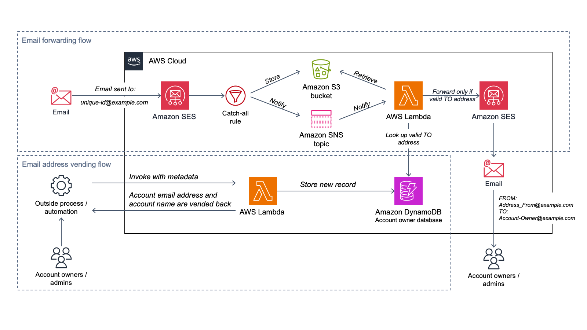

## aws-account-factory-email

This solution is designed as a way to allows AWS account owners to effectively
register more than one AWS account to a single email address by means of a
go-between email forwarder.

## Background
This solution describes how you can decouple real email addresses from the email
address that’s associated with an AWS account.  AWS accounts require a unique
email address be provided at the time of account creation.  In some
organizations, the team that manages AWS accounts must take on the burden of
managing many unique email addresses with their messaging team. While some
organizations do support email sub-addressing, also known as "plus" addressing
(explained in [RFC 5233](https://datatracker.ietf.org/doc/html/rfc5233)), not
every organization allows this or can implement this.

This solution provides a unique email address vending solution that enables AWS
account owners to associate one email address with multiple AWS accounts. The
real email addresses of AWS account owners are then associated with these
generated email addresses in a table. The solution handles all incoming email
for the unique email accounts, looks up the owner of each account, and then
forwards any received messages to the owner.  

For a detailed guide on how to implement this solution see [Register multiple
AWS accounts with a single email address by using Amazon
SES](https://docs.aws.amazon.com/prescriptive-guidance/latest/patterns/register-multiple-aws-accounts-with-a-single-email-address-by-using-amazon-ses.html).

## Solution Diagram

In this solution there are two flows:  
1. Vend an email address  
> In the diagram, the email address vending flow (lower section) begins typically with an account vending solution or outside automation, or is invoked manually. In the request, a Lambda function is called with a payload (examples in [src/events](src/events)) that contains the needed metadata. The function uses this information to generate a unique account name and email address, stores it in a DynamoDB database, and returns the values to the caller. These values can then be used to create a new AWS account (typically by using AWS Organizations).
2. Forward email
> This flow is illustrated in the upper section of the previous diagram. When an AWS account is created by using the account email generated from the email address vending flow, AWS sends various emails, such as account registration confirmation and periodic notifications, to that email address. By following the steps in this pattern, you configure your AWS account with Amazon SES to receive emails for the entire domain. This solution configures forwarding rules that allow Lambda to process all incoming emails, check to see if the TO address is in the DynamoDB table, and forward the message to the account owner's email address instead. Using this process gives account owners the ability to associate multiple accounts with one email address.
3. Read / Update / Delete Email Configuration (not pictured)
> Because this is an example of one way this functionality could be created, this solution does not yet implement a read, update, or delete flow that could be used to read the configuration, make modifications or remove mappings.  However, an administrator could create more Lambda functions to do this or use the AWS console directly to interact with the Account Table.  A recommended pattern is to implement [Amazon API Gateway](https://aws.amazon.com/api-gateway/) to provide an API for other applications to consume this functionality.

## Prerequisites
- Administrative access to an AWS account  
- Access to a development environment with the AWS CLI and IAM access to your AWS account.
- Set up and verify a domain name for use in receiving email with Amazon SES
    - You can use sub-domains like mysubdomain.example.com but try to keep the name as short as possible because there is an overall limit to the length of email addresses (64 characters)
    - The domain must be externally resolvable in order for it to receive emails
    - Follow the instructions in [Verifying a domain with Amazon SES](https://docs.aws.amazon.com/ses/latest/DeveloperGuide/verify-domain-procedure.html).  Once your domain is verified, it is ready to receive emails

## Tools needed for deployment
- You will need to install the following tools in your development environment.
    - AWS CLI. See [Installing, updating and uninstalling the AWS CLI version 2](https://docs.aws.amazon.com/cli/latest/userguide/install-cliv2.html)
    - Set up the AWS CLI with IAM access credentials. See [Configuring the AWS CLI](https://docs.aws.amazon.com/cli/latest/userguide/cli-chap-configure.html)
    - Python version 3.13 or later. Download the python package executable from [here](https://www.python.org/downloads/)
    - UV for Python package management. For installation instructions see [UV installation guide](https://docs.astral.sh/uv/getting-started/installation/)
    - Node.js version 22.x or later. For installation instructions see [Getting Started with the Nodejs](https://nodejs.org/en/learn/getting-started/how-to-install-nodejs)
    - AWS CDK CLI version 2.1019.2 or later. For installation instructions see [Getting Started with the AWS CDK](https://docs.aws.amazon.com/cdk/v2/guide/getting-started.html#getting-started-install)
    - Docker version 20.10.x or later. For installation instructions see [Getting Started with the Docker](https://docs.docker.com/engine/install/)

## Pre-Deployment Configuration
- At minimum, edit `SES_DOMAIN_NAME`, `ACCOUNT_FROM`, and `ACCOUNT_ADMIN` in `cdk.json`. See the cdk.json section below for more information on each setting
- Update `aws-cdk-lib==xxxx` in [requirements.in](./requirements.in) to the latest version. Use `npm view aws-cdk-lib` to get the latest version number (look for "latest:" in the output).
- After updating requirements.in, regenerate requirements.txt by running `uv pip compile requirements.in -o requirements.txt --python-version 3.13`

### cdk.json Settings

The [cdk.json](./cdk.json) file that is located in the root of the this
repository tells the CDK Toolkit how to execute your app.  There various
settings inside this file that control the application's behavior. Most of these
settings act like environment variables.

- SES_DOMAIN_NAME: Set this to the domain in which you want to receive incoming email.  You must own and verify this domain to receive email for this domain.  This solution does _not_ set up or verify the domain for you, see above.
- ACCOUNT_TABLE_NAME: This will be the name of the DynamoDB table that is deployed as part of this solution.
- ADDRESS_FROM: This is the email address that will be used as the FROM address for every email that is forwarded.  The domain part (after the '@' sign) must match the SES_DOMAIN_NAME.
- ADDRESS_ADMIN: This is the email address you wish to use if the solution is unable to find or forward an email to a valid account owner.  Emails will be SENT to this email address.  Typically customers set this to a shared mailbox that the IT team monitors.
- MAIL_HEADER_VALUE: This is the value of the X-Processed-By header that is added to every email forwarded through this system
- COUNTER_LENGTH: This is the length of the number appended to account names (including leading zeros). e.g. this-is-my-account-name-001
- DISABLE_CATCH_ALL: This setting is not present in cdk.json by default. By adding this setting with any value, it will disable the catch-all behavior and the solution will no longer forward messages where the account owner email is not found.  To help prevent a denial of service attack, the catch-all functionality should be disabled.  To enable catch-all, ensure this setting is NOT present in cdk.json.

## Deployment

This project was written to use the AWS CDK to define and provision the needed 
infrastructure for the solution.  Follow the steps below to deploy the solution.

1. Clone this repository to your development environment
    ```
    $ git clone <clone url for this repository>
    ```

2. Create a virtual environment using UV (assumes you are in the root of this repository):

    ```
    $ uv venv --python 3.13
    ```

3. Activate the virtual environment:

    ```
    $ source .venv/bin/activate
    ```

    > Or, if you are a Windows platform, you would activate the virtualenv like this:

    ```
    % .venv\Scripts\activate.bat
    ```

4. Install the required dependencies using UV:

    ```
    $ uv pip install -r requirements.txt
    ```

    > **Note**: This project uses UV for dependency management with requirements.in files. To update dependencies:
    > - Edit the appropriate requirements.in file
    > - Run `uv pip compile requirements.in -o requirements.txt --python-version 3.13` to regenerate requirements.txt
    > - Install updated dependencies with `uv pip install -r requirements.txt`
    > - Or use the helper script: `./update-deps.sh` to update all requirements.txt files at once

5. At this point you can now synthesize the CloudFormation template for this code. This allows you to view the CloudFormation template prior to deployment. If this command succeeds you will see many lines of YAML printed to your scree.

    ```
    $ cdk synth
    ```

6. To deploy the solution to your account / region, run the following replacing "ACCOUNT-NUMBER" and "REGION":
    ```
    $ cdk bootstrap aws://ACCOUNT-NUMBER/REGION
    $ cdk deploy
    ```

## Testing Python Code
There are also some basic Python unit tests included that test the solution's
core python functions (not the CDK code). 

To run the tests, you'll need boto3 and schema python libraries which you can
install using UV.
```
uv pip install -r tests/requirements.txt
```

You should now be able to run the tests:

```
$ python -m unittest
```

## Cleanup Steps
Run the following CDK command to remove the deployed infrastructure:
```
cdk destroy
```
Alternatively, you can delete the CloudFormation stack "AwsMailFwdStack" through the AWS Console.
## CDK Notes

### Useful commands

 * `cdk ls`          list all stacks in the app
 * `cdk synth`       emits the synthesized CloudFormation template
 * `cdk deploy`      deploy this stack to your default AWS account/region
 * `cdk diff`        compare deployed stack with current state
 * `cdk docs`        open CDK documentation

## Improvement Ideas
- Implement Read/Update/Delete flows for email address configurations
- Implement a Dead Letter Queue (DLQ) where undeliverable messages can go for archive or reprocessing

## Security

This project uses [CDK Nag](https://github.com/cdklabs/cdk-nag) to automatically
scan the infrastructure code for security best practices and compliance
violations. CDK Nag is a static analysis tool that checks AWS CDK applications
against a set of security rules based on AWS Well-Architected Framework
principles and industry standards.

### What is CDK Nag?

CDK Nag performs security and compliance checks on your CDK code before
deployment, helping identify potential security issues such as:
- Overly permissive IAM policies
- Unencrypted resources
- Missing security configurations
- Non-compliant resource configurations

### Viewing CDK Nag Results

CDK Nag runs automatically during `cdk synth` and `cdk deploy` operations. The
security scan results are available in multiple ways:

1. **JSON Report**: After running `cdk synth`, check the `cdk.out/` directory for the file `AwsSolutions-AwsMailFwdStack-NagReport.json`
2. **Console Output**: Security findings are displayed in the terminal during synthesis
3. **Build Logs**: If using CI/CD, findings appear in your build logs

### Understanding the Report

The CDK Nag report categorizes findings by severity and provides:
- **Rule ID**: The specific security rule that was triggered
- **Resource**: The AWS resource that has the issue  
- **Reason**: Explanation of why this is flagged as a security concern
- **Suppressions**: Any explicitly suppressed findings with justification

Many findings in this project have been suppressed with documented business
justifications in the CDK code. Review these suppressions to ensure they align
with your organization's security requirements.


## Contributions

See [CONTRIBUTING](CONTRIBUTING.md#security-issue-notifications) for more information.

## License

This library is licensed under the MIT-0 License. See the LICENSE file.

